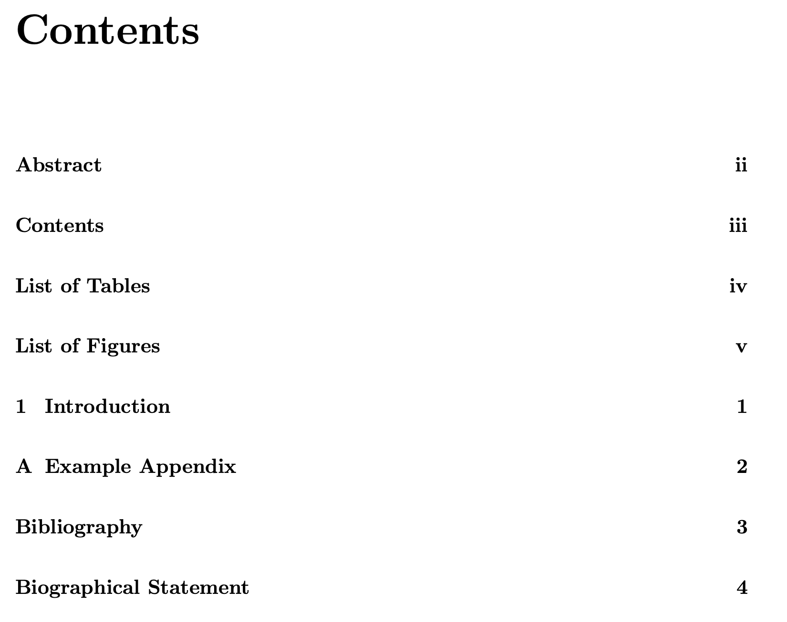
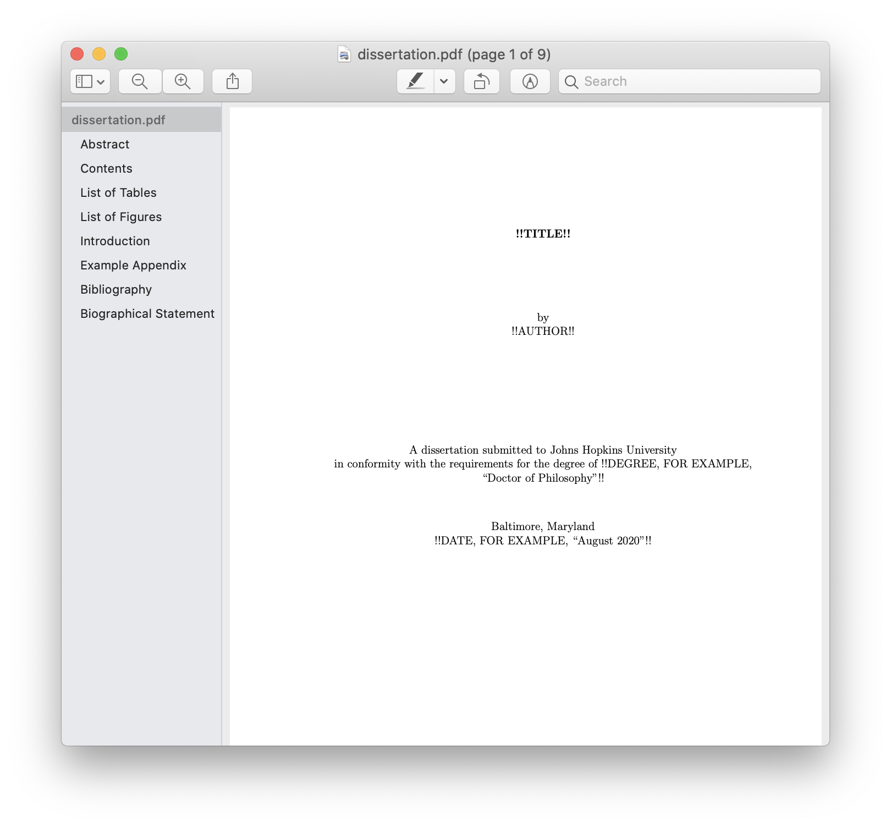
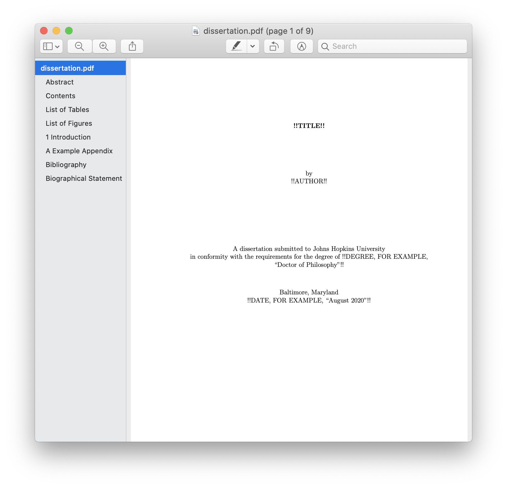

# [LaTeX](https://www.latex-project.org) Dissertation Template for the [Johns Hopkins University](https://www.jhu.edu)

[**Source**](https://github.com/leafac/latex-dissertation-template-for-the-johns-hopkins-university)

This is a LaTeX template that conforms to the [Formatting Requirements](https://www.library.jhu.edu/library-services/electronic-theses-dissertations/formatting-requirements/) given by the Johns Hopkins University Library.

**Disclaimer:** This template is here to help but offers no guarantees. You’re still responsible for ensuring that your dissertation conforms to the requirements.

## Compiling

Run [`latexmk`](https://ctan.org/pkg/latexmk):

```
$ latexmk
```

The generated PDF will be at [`dissertation.pdf`](dissertation.pdf).

## Contents

<details>
<summary><code>dissertation.tex</code>: Main Document</summary>

```latex
\documentclass[12pt, oneside]{book}
```

The `book` document class conforms to most of the formatting requirements and is one of the default document classes included with LaTeX.

The `12pt` option increases the font size of body text from the default `10pt`. This is optional, because the formatting guidelines would allow for `10pt`, but combined with a wider margin (see below), a bigger font reduces line length, which makes the document [more comfortable to read](https://practicaltypography.com/line-length.html).

The `oneside` option makes the margins the same in all pages, instead of the default behavior which is to account for binding and make the wider margin alternate from left on odd pages to right on even pages.

```latex
\usepackage[a-1b]{pdfx}
```

Including the [`pdfx` package](https://ctan.org/pkg/pdfx) with the `a-1b` option tells LaTeX to produce the specific kind of PDF that the library requires: PDF/A. A PDF/A is a special kind of PDF meant for **a**rchival, which means that: 1. It includes metadata for indexing, which you must specify in a file called `dissertation.xmpdata` (see below); 2. It includes all the data necessary to reproduce the document well into the future, for example, it must embed the fonts used in the document; and 3. It must not contain interactive content such as video, audio, JavaScript, and so forth.

For technical reasons, the `pdfx` package can’t guarantee that the produced PDF complies to the PDF/A standard, so you must validate the document yourself. The golden standard for this validation is [Adobe Acrobat Pro DC](https://acrobat.adobe.com/us/en/acrobat/acrobat-pro.html), which includes a tool called **Preflight** capable of detecting problems and fixing them. But Adobe Acrobat Pro DC is a paid, so you may prefer to use an [online validator](https://www.pdf-online.com/osa/validate.aspx) instead. Beware that these alternative tools may not be completely accurate. (As far as I can tell, the library uses Adobe Acrobat Pro DC.)

```latex
\hypersetup{hidelinks, bookmarksnumbered}
```

Configuration for the [`hyperref` package](https://ctan.org/pkg/hyperref), which is included by `pdfx` (see above).

The `hidelinks` option tells `hyperref` to **not** to decorate links with colored boxes:

| Without `hidelinks`                                                          | With `hidelinks`                                                       |
| ---------------------------------------------------------------------------- | ---------------------------------------------------------------------- |
|  |  |

The `bookmarksnumbered` option tells `hyperref` to include the numbers of the sections on the table of contents displayed by PDF viewers:

| Without `bookmarksnumbered`                                                                  | With `bookmarksnumbered`                                                               |
| -------------------------------------------------------------------------------------------- | -------------------------------------------------------------------------------------- |
|  |  |

```latex
\usepackage{tocbibind}
```

Including the [`tocbibind` package](https://ctan.org/pkg/tocbibind) causes the Bibliography to appear on the table of contents.

```latex
\usepackage[top = 1in, right = 1in, bottom = 1in, left = 1.5in]{geometry}
```

The [`geometry` package](https://ctan.org/pkg/geometry) sets the margins. The formatting requirements allow for a left of margin of either 1″ (which they recommend for documents that will only be presented in digital format) or 1.5″ (which they recommend for documents that may be printed, where the extra space accounts for the binding). We use a left of margin of 1.5″ even if the document is only meant to be read on the screen, because combined with a bigger font (see above), a wider margin reduces line length, which makes the document [more comfortable to read](https://practicaltypography.com/line-length.html).

```latex
\pagestyle{plain}
```

The `plain` page style puts the page numbers centered on the bottom margin, following the formatting requirements. It also remove unnecessary decorations, for example, headers with the name of the current chapter.

```latex
\usepackage[doublespacing]{setspace}
```

The [`setspace` package](https://ctan.org/pkg/setspace) with the `doublespacing` sets double space between lines in the text body, following the formatting requirements.

```latex
\begin{document}

\frontmatter
```

The body of the document begins, and we declare the start of the front matter. The front matter is different from the rest of the document in two ways: 1. The chapters (for example, **Abstract**, **Acknowledgements**, and so forth) aren’t numbered; and 2. Page numbers use Roman numerals (for example, i, ii, iii, and so forth) instead of Arabic numerals (for example, 1, 2, 3, and so forth).

```latex
\begin{center}
\begin{singlespace}
```

This is the beginning of the title page, which must be centered and use single space between the lines (the `singlespace` environment is provided by the `setspace` package we included above).

```latex
\vspace*{0.5in}
```

There must be a space of 1.5″ before the title, which we accomplish with the 1″ margin plus 0.5″ of vertical space.

</details>

<details>
<summary><code>dissertation.bib</code>: Bibliography</summary>

```bib
@misc{template,
  author = "Leandro Facchinetti",
  title = "{LaTeX} {Dissertation} {Template} for the {Johns} {Hopkins} {University}",
  howpublished = "\url{https://github.com/leafac/latex-dissertation-template-for-the-johns-hopkins-university}",
  note = "Accessed 2020-03-13"
}
```

The existing content is just an example of an entry. For more on managing a bibliography, refer to the [BibTeX](https://ctan.org/pkg/bibtex) documentation. Or use a citation manager such as [Zotero](https://www.zotero.org) or [BibDesk](https://bibdesk.sourceforge.io), which produce a `.bib` file.

</details>

<details>
<summary><code>dissertation.xmpdata</code>: PDF/A Metadata</summary>

```latex
\Title{!!TODO!!}
\Author{!!TODO!!}
\Language{!!TODO, FOR EXAMPLE, “en-US”!!}
\Keywords{!!TODO!!\sep !!TODO!!\sep ...}
\Subject{!!TODO!!}
```

See the discussion about PDF/A in the section about `dissertation.tex` above. You may inspect some of the metadata using, for example, Preview in macOS by going to **Tools > Show Inspector**:

<p align="center">

</p>

For more information, including other fields that you may configure in this file, refer to the documentation for the [`pdfx` package](https://ctan.org/pkg/pdfx).

</details>

<details>
<summary><code>.latexmkrc</code>: <code>latexmk</code> Configuration</summary>

```
$pdf_mode = 1;
```

Configure [`latexmk`](https://ctan.org/pkg/latexmk) (see [§ Compiling](#compiling)) to produce a PDF using the [`pdflatex`](https://ctan.org/pkg/pdftex) executable, instead of the default which is to produce a DVI using the `latex` executable.

</details>

## Beyond

TODO

## Related Work

The [Johns Hopkins University Library](https://www.library.jhu.edu/library-services/electronic-theses-dissertations/formatting-requirements/) mentions [this other LaTeX template](https://github.com/jrclayton/jhu-dissertation-mwe). What makes our template different is that it’s small and comes with [line-by-line explanations](#contents).
