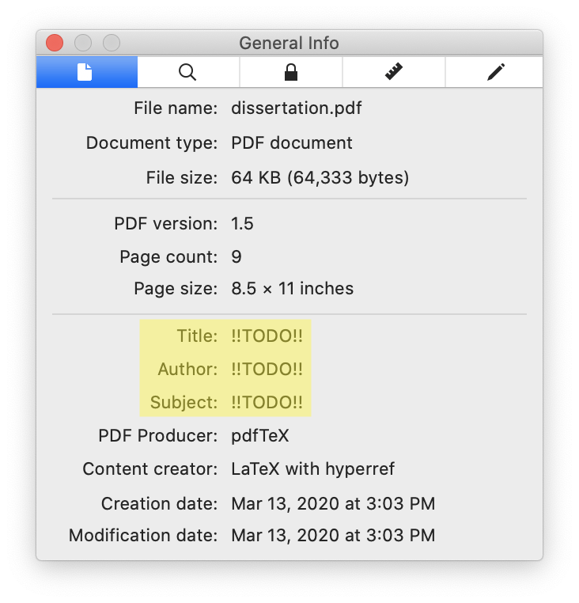

<h1 align="center"><a href="https://www.latex-project.org">LaTeX</a> Dissertation Template for the <a href="https://www.jhu.edu">Johns Hopkins University</a></h1>
<h3 align="center">A LaTeX template that conforms to the <a href="https://www.library.jhu.edu/library-services/electronic-theses-dissertations/formatting-requirements/">Formatting Requirements</a> of the Johns Hopkins University Library</h3>
<p align="center">
<a href="https://github.com/leafac/latex-dissertation-template-for-the-johns-hopkins-university"></a>
</p>

**Warning:** This template is here to help but offers no guarantees. You’re still responsible for ensuring that your dissertation conforms to the requirements.

**Note:** Other universities have similar formatting requirements, so you may be able to adapt parts of this template even if you study somewhere else. And in any case this template is a good example of how to keep things simple when using LaTeX.

## Compiling

Run [`latexmk`](https://ctan.org/pkg/latexmk):

```
$ latexmk
```

You may find the generated PDF at [`dissertation.pdf`](dissertation.pdf).

## Contents

<details>
<summary><code>dissertation.tex</code>: Main Document</summary>

```latex
\documentclass[12pt, oneside]{book}
```

The `book` document class by itself already conforms to most of the formatting requirements and it’s one of the default document classes included with LaTeX.

The `12pt` option increases the font size of the body text from the default `10pt`. This is optional, because the formatting requirements would allow for `10pt`, but combined with a wider margin (see below), a bigger font reduces line length, which makes the document [more comfortable to read](https://practicaltypography.com/line-length.html).

The `oneside` option has two effects. First, it prevents LaTeX from inserting blank pages so that every chapter would start on a right-facing page. Second, it makes the margins the same on all pages, instead of the default behavior which is to account for binding and make the wider margin alternate on left- and right-facing pages.

```latex
\usepackage[a-1b]{pdfx}
```

Including the [`pdfx` package](https://ctan.org/pkg/pdfx) with the `a-1b` option tells LaTeX to produce the specific kind of PDF that the library requires: PDF/A. A PDF/A is a special kind of PDF meant for **a**rchival, which is different from a regular PDF in three ways. First, it includes metadata for indexing, which you must specify in a file called `dissertation.xmpdata` (see below). Second, it includes all the data necessary to reproduce the document well into the future; for example, it embeds the fonts used in the document. And third, it doesn’t contain interactive content such as video, audio, JavaScript, and so forth.

For technical reasons, the `pdfx` package can’t guarantee that the produced PDF complies to the PDF/A standard, so you must validate it yourself. The golden standard for this kind of validation is [Adobe Acrobat Pro DC](https://acrobat.adobe.com/us/en/acrobat/acrobat-pro.html), which includes a tool called **Preflight** capable of detecting problems and fixing them. But Adobe Acrobat Pro DC is paid, so you may prefer to use an [online validator](https://www.pdf-online.com/osa/validate.aspx) instead. Beware that these alternative tools may not be completely accurate.

<p align="center">

</p>

```latex
\hypersetup{hidelinks, bookmarksnumbered}
```

Configuration for the [`hyperref` package](https://ctan.org/pkg/hyperref), which is included by `pdfx` (see above).

The `hidelinks` option tells `hyperref` to **not** to decorate links with colored boxes:

| Without `hidelinks`                                                         | With `hidelinks`                                                      |
| --------------------------------------------------------------------------- | --------------------------------------------------------------------- |
|  |  |

The `bookmarksnumbered` option tells `hyperref` to include the numbers of the sections on the table of contents displayed by PDF viewers:

| Without `bookmarksnumbered`                                                                 | With `bookmarksnumbered`                                                              |
| ------------------------------------------------------------------------------------------- | ------------------------------------------------------------------------------------- |
|  |  |

```latex
\usepackage{tocbibind}
```

Including the [`tocbibind` package](https://ctan.org/pkg/tocbibind) causes the Bibliography to appear on the table of contents.

```latex
\usepackage[top = 1in, right = 1in, bottom = 1in, left = 1.5in]{geometry}
```

The [`geometry` package](https://ctan.org/pkg/geometry) sets the margins. The formatting requirements allow for a left of margin of either 1″ (which they recommend for documents that are presented only on screen) or 1.5″ (which they recommend for documents that may be printed, where the extra space accounts for the binding). We use a left of margin of 1.5″ even if the document is presented only on screen because, combined with a bigger font (see above), a wider margin reduces line length, which makes the document [more comfortable to read](https://practicaltypography.com/line-length.html).

```latex
\pagestyle{plain}
```

The `plain` page style sets the page numbers centered on the bottom margin. It also removes unnecessary decorations, for example, headers with the name of the current chapter.

```latex
\usepackage[doublespacing]{setspace}
```

The [`setspace` package](https://ctan.org/pkg/setspace) with the `doublespacing` option sets double space between lines in the text body.

```latex
\begin{document}

\frontmatter
```

The body of the document and the front matter begin. The front matter is different from the rest of the document in two ways. First, the chapters (for example, **Abstract**, **Acknowledgements**, and so forth) aren’t numbered. And second, the page numbers use Roman numerals (for example, i, ii, iii, and so forth) instead of Arabic numerals (for example, 1, 2, 3, and so forth).

```latex
\begin{center}
\begin{singlespace}
```

The beginning of the title page.

The `center` environment makes the contents of the title page centered within the margins.

The `singlespace` environment sets a single space between the lines of the title page. (The `singlespace` environment is provided by the `setspace` package we included above.)

**Note:** We don’t use the LaTeX facilities for creating title pages because they don’t follow the formatting requirements: the `\maketitle` command doesn’t give enough control over the appearance, and the `titlepage` environment causes the title page to not count toward the page count.

```latex
\vspace*{0.5in}
```

There must be a space of 1.5″ before the title, which we accomplish with a margin of 1″ (see above) plus a **v**ertical **space** of 0.5″. We use `\vspace*` instead of `\vspace` to prevent LaTeX from collapsing the space with the margin.

```latex
\textbf{\uppercase{!!TITLE!!}}
```

The `\textbf` command makes the title bold.

The `\uppercase` command makes the title all capital letters.

```latex
\vspace*{1in}

by\\!!AUTHOR!!

\vspace*{1.5in}

A dissertation submitted to Johns Hopkins University\\in conformity with the requirements for the degree of !!DEGREE, FOR EXAMPLE, “Doctor of Philosophy”!!

\vspace*{0.5in}

Baltimore, Maryland\\!!DATE, FOR EXAMPLE, “August 2020”!!
```

The rest of the information that must appear on the title page, separated by vertical spaces.

The `\\` causes a line break. If the title is too long, use `\\` to ensure that the line break appears in a desirable position.

```latex
\end{singlespace}
\end{center}

\thispagestyle{empty}
\clearpage
```

The end of the title page.

First, we close the `singlespace` and the `center` environments.

Then, we set the page style for the title page as `empty`, which hides the page number (though the page still counts toward the page count).

Finally, we use the `\clearpage` command so that the following material starts on a new page. (This isn’t strictly necessary because the following material is a `\chapter{}`, which already starts on a new page, but it’s a good measure to use the `\clearpage` command nonetheless.)

```latex
\chapter{Abstract}

!!TODO!!

\paragraph{Primary Reader and Advisor:}

!!TODO!!

\paragraph{Readers:}

!!TODO!!

!!OPTIONAL EXTRA CHAPTERS, FOR EXAMPLE, “Acknowledgements” AND “Dedication”!!
```

The rest of the front matter.

```latex
\tableofcontents
\listoftables
\listoffigures
```

The table of contents, and the lists of tables and figures. You may remove the lists if you don’t have tables or figures in your dissertation.

```latex
\mainmatter
```

The beginning of the main matter, which has two effects. First, the chapters are numbered. And second, the page count resets to 1 and uses Arabic numerals (for example, 1, 2, 3, and so forth) instead of Roman numerals (for example, i, ii, iii, and so forth).

```latex
\chapter{Introduction}

!!TODO!!

!!EXAMPLE CITATION: \cite{template}!!
```

This is where the body of the dissertation lives. Add chapters here with the rest of your material (that’s the hard part!).

The example citation refers to an entry on the `dissertation.bib` file (see below).

```latex
\appendix

\chapter{Example Appendix}

!!OPTIONAL!!
```

The beginning of the appendix, which changes the counter of the chapters from numbers (for example, 1, 2, 3, and so forth) to letters (for example, A, B, C, and so forth). Either add chapters here or remove the appendix altogether.

```latex
\backmatter
```

The beginning of the back matter, which makes the chapters unnumbered again, as they were in the front matter.

```latex
\bibliographystyle{plain}
\bibliography{\jobname}
```

The bibliography.

The `plain` style sets the citations as numbers, for example, `[29]`.

The `\jobname` makes BibTeX look for the the bibliography in a file named `dissertation.bib`. If you change the name of this file from `dissertation.tex` to `something-else.tex`, then change the bibliography from `dissertation.bib` to `something-else.bib` as well.

```latex
\chapter{Biographical Statement}

!!TODO!!
```

The biographical statement appears on the last page of the document.

```latex
\end{document}
```

The end of the document.

</details>

<details>
<summary><code>dissertation.bib</code>: Bibliography</summary>

```bib
@misc{template,
  author = "Leandro Facchinetti",
  title = "{LaTeX} {Dissertation} {Template} for the {Johns} {Hopkins} {University}",
  howpublished = "\url{https://github.com/leafac/latex-dissertation-template-for-the-johns-hopkins-university}",
  note = "Accessed 2020-03-13"
}
```

The existing content is just an example of an entry. For more on managing a bibliography, refer to the [BibTeX](https://ctan.org/pkg/bibtex) documentation. Or use a citation manager such as [Zotero](https://www.zotero.org) or [BibDesk](https://bibdesk.sourceforge.io), which produce a `.bib` file.

</details>

<details>
<summary><code>dissertation.xmpdata</code>: PDF/A Metadata</summary>

```latex
\Title{!!TODO!!}
\Author{!!TODO!!}
\Language{!!TODO, FOR EXAMPLE, “en-US”!!}
\Keywords{!!TODO!!\sep !!TODO!!\sep ...}
\Subject{!!TODO!!}
```

See the discussion about PDF/A in the section on `dissertation.tex` above. You may inspect some of the metadata using, for example, Preview in macOS by going to **Tools > Show Inspector**:

<p align="center">

</p>

For more information, including other fields that you may configure in this file, refer to the documentation for the [`pdfx` package](https://ctan.org/pkg/pdfx).

</details>

<details>
<summary><code>.latexmkrc</code>: <code>latexmk</code> Configuration</summary>

```
$pdf_mode = 1;
```

Configure [`latexmk`](https://ctan.org/pkg/latexmk) (see [§ Compiling](#compiling)) to produce a PDF using the [`pdflatex`](https://ctan.org/pkg/pdftex) executable, instead of the default which is to produce a DVI using the `latex` executable (see the `latexmk` manual for details on this magic number).

</details>

## Extras

<details>
<summary>Pictures</summary>

To include pictures in your document, use the [`graphicx` package](https://ctan.org/pkg/graphicx). Add the following before `\begin{document}` in `dissertation.tex`:

```latex
\usepackage{graphicx}
```

Then, anywhere in the document, include a picture with the following

```latex
\includegraphics{picture.pdf-or-png-or-jpg-and-so-forth}
```

Watch [this video](https://www.leafac.com/using-keynote-to-draw-figures-for-latex-documents/) for more advice on how to draw pictures for LaTeX documents using [Keynote](https://www.apple.com/keynote/) on macOS.

</details>

<details>
<summary>Other Fonts</summary>

**Warning:** Other fonts may not include the metadata necessary to produce a valid PDF/A (see the discussion about PDF/A in the section on `dissertation.tex` above). Test the document produced with other fonts on a PDF/A validator.

If you don’t select a font for your document, then LaTeX uses default choices that, because they’re the default, have been overused. Fortunately, most LaTeX distributions include a good selection of fonts and you may even use the fonts installed on your operating system.

If you are collaborating with other people who may have different fonts installed, then it’s a better idea to choose from the fonts that are included in most LaTeX distributions. Check the [The LaTeX Font Catalog](https://tug.org/FontCatalogue/) for a list of these fonts along with instructions on how to use them.

When selecting different fonts, your first decision is which font format to use. There are two common formats and you must not mix between them in the same document. Some fonts are available only in one of these formats, so the format may affect your choice of fonts.

The first format, which is the default, is an old format called PostScript Type 1. When The LaTeX Font Catalog doesn’t specify the format of a font, it’s in the PostScript Type 1 format.

The second format is the more modern OTF/TTF format. Some fonts in The LaTeX Font Catalog support both the PostScript Type 1 format and the OTF/TTF format, while others support only one of them. Most of the fonts you have installed on your operating system are in the OTF/TTF format.

The format of the fonts in your document affect how you compile it. To compile a document using fonts in the PostScript Type 1 format, use the `pdflatex` executable as usual. To compile a document using fonts in the OTF/TTF format, replace `pdflatex` with a different executable called [`lualatex`](http://www.luatex.org).

**Note:** There’s yet another executable called `xelatex` that also handles fonts in the OTF/TTF format, but it’s more difficult to configure to generate a PDF/A.

The decision between `pdflatex` and `lualatex` may also be dictated by other factors. For example, if you must include source code in your document, then it’s better to use `lualatex` because `pdflatex` may render characters such as `` ` `` incorrectly (see discussion about **Syntax Highlighting** below).

The `lualatex` executable is already included in most LaTeX distributions, so to compile your document using it you just have to configure `latexmk` by adding the following to `.latexmkrc`:

```
$pdflatex = 'lualatex %O %S';
```

**Note:** If you’re also using a syntax highlighter (see below), then include the `-shell-escape` option as well.

The `$pdflatex` variable specifies which command to run to produce a PDF. The `%O` stands for the compiler **o**ptions passed when invoking `latexmk` (for example, `-file-line-error`) and the `%S` stands for the **s**ource file (for example, `dissertation.tex`).

**Note:** We could instead have changed `$pdf_mode = 1;` to `$pdf_mode = 4;` (see the `latexmk` manual for details on these magic numbers), but tools like [LaTeX Workshop](https://marketplace.visualstudio.com/items?itemName=James-Yu.latex-workshop) overwrite that option.

The following is an example of how to specify different fonts (this must appear before `\begin{document}` in `dissertation.tex`):

```latex
\usepackage{fontspec, unicode-math}
\setmainfont{PT Serif}
\setmonofont{PT Mono}
\setmathfont{Asana Math}
```

The [`fontspec` package](https://ctan.org/pkg/fontspec) allows for selecting text fonts, and the [`unicode-math` package](https://ctan.org/pkg/unicode-math) allows for selecting mathematical fonts.

In this example, the main font of the document is set to [PT Serif](http://www.paratype.com/public/), the monospaced font is set to PT Mono, and the mathematical font is set to Asana Math. All of these fonts are included by default in most LaTeX distributions. PT Serif and PT Mono are included in macOS as well, which is useful, for example, to draw pictures in Keynote (see above), but they’re hidden in the font selectors; to select these fonts, go to **Format > Font > Show Fonts > (Collection) All Fonts > PT Serif**.

Refer to the manuals of the packages mentioned above for more information, including how to select fonts that you have installed in your operating system.

</details>

<details>
<summary>Syntax Highlighting</summary>

If you include source code in your dissertation, then it’s a good idea to syntax highlight it. To accomplish this, you must follow three steps: first, install an external program to do syntax highlighting; second, configure `latexmk` to allow the LaTeX compiler to call this external program; and third, include the [`minted` package](https://ctan.org/pkg/minted), which calls this external program from within LaTeX.

As an external program to do syntax highlighting, install [Shiki LaTeX](https://www.npmjs.com/package/latex-dissertation-template-for-the-johns-hopkins-university).

**Note:** Traditionally the external program used to do syntax highlighting is [Pygments](https://pygments.org), but [Shiki](https://shiki.matsu.io) generally yields better results.

**Disclaimer:** Shiki LaTeX is developed by [the author of this template](https://www.leafac.com).

To configure `latexmk` to allow the LaTeX compiler to call Shiki LaTeX, add the following to `.latexmkrc`:

```
$pdflatex = 'lualatex -shell-escape %O %S';
```

The `lualatex` executable is used instead of the `pdflatex` executable because otherwise characters such as `` ` `` may not be rendered correctly (see discussion about **Other Fonts** above for more on the `lualatex` executable).

The `-shell-escape` option allows the LaTeX compiler to call external programs.

**Warning:** You must trust the LaTeX source for the document that you’re compiling with the `-shell-escape` option, because you’re granting it the privilege to run arbitrary commands on your machine.

To include the `minted` package, add the following before `\begin{document}` in `dissertation.tex`:

```latex
\usepackage{minted}
\renewcommand{\MintedPygmentize}{node_modules/.bin/shiki-minted}
\setminted{fontsize = \footnotesize, baselinestretch = 1.2, breaklines}
\setmintedinline{fontsize = \normalsize, breaklines = false}
```

The `\renewcommand` line tells `minted` to use Shiki LaTeX instead of the default Pygments.

The `\setminted` line configures the code listings to use a smaller font and a smaller space between lines, and to allow lines that are too long to be wrapped.

The `\setmintedinline` line configures the inline code to revert some of the configuration set above that should be specific to code listings. We disable line breaks because otherwise inline code in a mathematical environment (for example, `$\mintinline{js}{x}$`) renders with a mathematical fonts instead of a monospaced font.

Finally, the following is an example of a code listing that is highlighted as [TypeScript](https://www.typescriptlang.org):

```latex
\begin{minted}{ts}
export function evaluate(input: string): string {
  return prettify(run(parse(input)));
}
\end{minted}
```

<p align="center">

</p>

And the following is an example of inline code that is highlighted as JavaScript:

```latex
arrays (for example, \mintinline{js}{["Leandro", 29]}),
```

<p align="center">

</p>

See the documentation for the [`minted` package](https://ctan.org/pkg/minted) for more information.

</details>

<details>
<summary>Frames</summary>

Frames are useful to set apart material that demands extra attention, that should be easy to find while skimming, or that is an aside which may be skipped, for example:

<p align="center">

</p>

To use frames in a document, include the [`mdframed` package](https://ctan.org/pkg/mdframed) by adding the following before `\begin{document}` in `dissertation.tex`:

```latex
\usepackage[framemethod = tikz, middlelinewidth = 1pt, roundcorner = 3pt]{mdframed}
```

The `framemethod` option tells `mdframed` to use the [`TikZ` package](https://www.ctan.org/pkg/pgf) to draw the frames, which is necessary for round corners.

The `middlelinewidth` option specifies how thick are the frames.

The `roundcorner` option specifies roudned corners for the frames.

Finally, the following is an example of some framed material:

```latex
\begin{mdframed}[frametitle = {Technical Terms}]
Yocto-JavaScript is a representation of something called the \emph{$\lambda$-calculus}~\cite[§~6]{understanding-computation}.
\end{mdframed}
```

</details>

<details>
<summary>A GitHub Action to Build Your Document</summary>

It’s a good idea to build your document on every push in a [GitHub Action](https://github.com/features/actions) to identify problems that occur only on the machine of a particular collaborator. The following is an example configuration:

```yml
# .github/workflows/main.yml

on: push
jobs:
  main:
    runs-on: ubuntu-latest
    steps:
      - uses: actions/checkout@v2
      - uses: actions/setup-node@v1
        with:
          node-version: "14.x"
      - run: |
          echo 'deb http://azure.archive.ubuntu.com/ubuntu/ eoan main restricted universe multiverse' | sudo tee -a /etc/apt/sources.list
          sudo apt update
          sudo apt install --yes texlive-full
          npm ci
          latexmk
      - uses: actions/upload-artifact@v1
        with:
          name: Dissertation
          path: dissertation.pdf
```

We configure a different repository to get the latest version of LaTeX, which is necessary to build a PDF/A document. We also install [Node.js](https://nodejs.org) for the syntax highlighter (see above); if it were not for the syntax highlighter, we may have chosen to use [an existing Action](https://github.com/marketplace/actions/github-action-for-latex), which is simpler to configure and much faster.

</details>

## Related Work

The [Johns Hopkins University Library](https://www.library.jhu.edu/library-services/electronic-theses-dissertations/formatting-requirements/) mentions [this other LaTeX template](https://github.com/jrclayton/jhu-dissertation-mwe). What makes our template different is that it’s smaller and comes with [line-by-line explanations](#contents).
